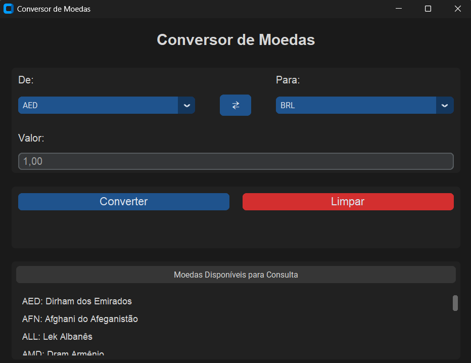

# Conversor de moedas em Python
 
## Entenda o projeto do conversor de moedas em Python aqui
 
 
Projeto desenvolvido pela sala do 2º ano da escola SESI no V itineráio do SENAI que se atualiza constantemente
 
## Funcionalidades
 
- Escolha de uma moeda de origem (Moeda que será convertida);
- Escolha de uma moeda de destino (Moeda que irá converter);
- Modo tela cheia;
- Botão para a realização da conversão;
- Espaço destinado a informar o valor da conversão;
- Sumário das moedas e suas siglas.
 
 
## Instalação
 
Instalação de Bibliotecas do Visual Studio Code
 
- customtkinter
- requests
- xmltodict
 
```bash
pip install customtkinter requests xmltodict
```
 
## Pré-requisitos
 
- Visual Studio Code
- Biblioteca customtkinter no Visual Studio Code
- Biblioteca requests no Visual Studio Code
- Biblioteca xmltodict no Visual Studio Code
- Arquivos xml fornecidos pelo site AwesomeAPI
 
## Links AwesomeAPI
 
- Site: https://docs.awesomeapi.com.br/api-de-moedas
- Lista completa de combinações: https://economia.awesomeapi.com.br/xml/available
- Lista de nomes das moedas https://economia.awesomeapi.com.br/xml/available/uniq
## Screenshots
 

 
 
## Aprendizados
 
Construindo esse projeto, o grupo desenvolveu maior maestria na linguagem de programação Python, no Visual Studio Code, com a importação e aplicação de bibliotecas. A equipe aprimorou o vinculo de trabalho em quipe entre os integrantes, ao construir o código, houve problemas que persistiram na codificação, porém com um pouco de atenção eles foram superados. Um dos grandes aprendizados do grupo foram explorar novas funcionalidades na documentação da biblioteca e desenvolver outras funções.
 
## Autores
 
Projeto realizado pelo sala do 2º ano da escola SESI de Osvaldo Cruz CE283, no V itinerário, junto ao SENAI
 
### Alunos
 
- Ariel Thiago Bisoli Ribeiro Nº18
- João Rafael Zanuto  Nº11
- Matheus de Souza Alves Pereira Nº12
- Wuallan Meira Gomes Davila Nº23
 
### Professores
 
- Wagner de Campos Sabor Junior
- Irineu Francisco de Souza